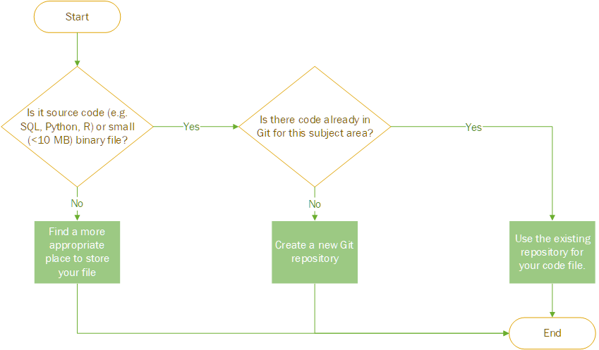

## Template Repository

Template repositories allow developers to start a new repository using a standard set of files and folder structure. All new respositories should be created using an appropriate template repository.

### [GitCore Template Repository](https://github.com/uwhealth-is/GitCore-template-repository)
All purpose template to create a repository with standard documentation.

## What should I put into git?

Use the following flowchart to decide if you should commit a file to git:

