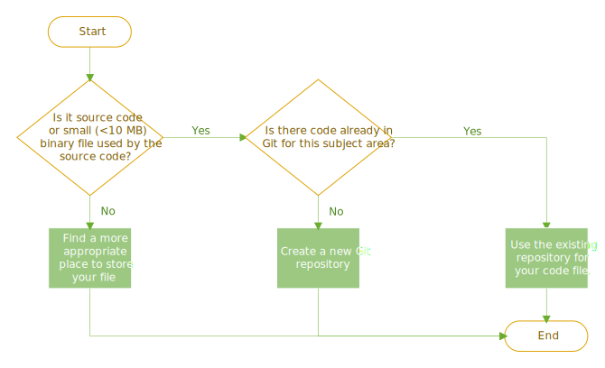

## Why should I use GitHub?

GitHub is a tool that supports many elements of the [Software Development Life Cycle (SDLC) Administrative Policy 1.73](https://uconnect.wisc.edu/policies/administrative/uw-health-administrative/administration/173.policy).
It is based on the [Git](https://git-scm.com/) version control system, which stores files and tracks changes to maintain their revision history. 

These are some of the capabilities provided by GitHub:
- Easily collaboration with others
- Work on copy of code without affecting other's work
- Automatically merge changes from multiple people
- Standardize processes for reviewing code and promoting it to production

## What should I put into GitHub?

GitHub should be used to manage source code and its related files. Any source code that is used by more than one person or runs an organizational
process should be maintained with a version control system like GitHub. 

These are examples of source code:
- C#
- CSS
- HTML
- JavaScript
- PHP
- PowerShell
- Python
- R
- SQL

Use this flowchart to help decide if something should be in GitHub:

## Template Repositories

Template repositories allow developers to start a new repository using a standard set of files and folder
structure. All new repositories should be created using an appropriate template repository.

### [GitCore Template Repository](https://github.com/uwhealth-is/GitCore-template-repository)
All purpose template to create a repository with standard documentation.

